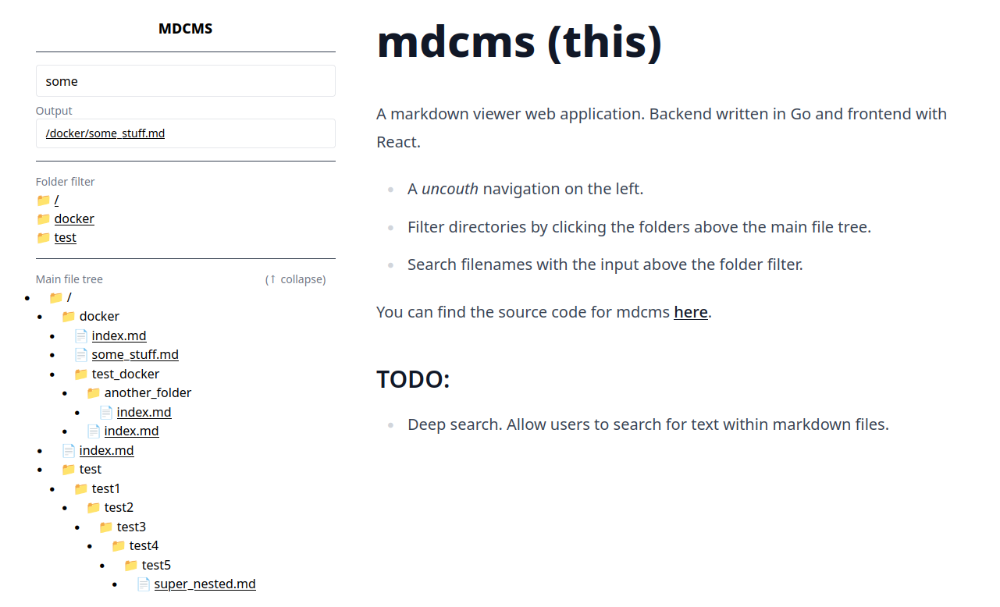

# mdcms v0.0.1

SPA markdown viewer.




## Environment variables

You will need to define environment variables for:
- `VITE_SITE_NAME`
    - Inside `webui/.env`
    - Change to reflect simple site name
- `VITE_API_URL`
    - Inside `webui/.env`
    - (PROD) Change to reflect the URL of the API (needs to be exposed)
- `CORS_ORIGIN`
    - Inside `docker-compose.yml`
    - (PROD) Change to reflect the URL of the web application

## Development

To continue development, you can spawn the front and backend services:

1. Set your environment variables. `CORS_ORIGIN` when not assigned a value will wildcard by default. The default `.env` file within `webui/` will have the correct values for `VITE_SITE_NAME` and `VITE_API_URL`.

TLDR; You only need to set the environment variable for `MDCMS_CONTENT_FOLDER`.

```sh
# CAVEAT!!: the root folder MUST be named mdcms_content

export MDCMS_CONTENT_FOLDER=<PATH TO CONTENT>
```

2. Fire up the API:
```sh
cd backend
go run main.go
```

3. Fire up the web UI:
```sh
cd webui
npm i
npm run dev
```

## Prod Deployment

1. Set your environment variables
2. Change the volume mount within `docker-compose.yml` (default: `/opt/mdcms_content`) to wherever you store your content.
3. Fire up Compose
```sh
docker compose up --build -d
```

This should then spawn the API on port `8090` and the web UI on `3030`. You may use NGINX to proxy pass to designated server names.. if you wish.

### Example NGINX Config

```conf
server {
        server_name api.mydomain.com;

        location / {
                proxy_set_header   X-Forwarded-For $remote_addr;
                proxy_set_header   Host $http_host;
                proxy_pass         "http://localhost:8090";
        }
}

server {
        server_name mydomain.com;

        location / {
                proxy_set_header   X-Forwarded-For $remote_addr;
                proxy_set_header   Host $http_host;
                proxy_pass         "http://localhost:3030";
        }
}
```
